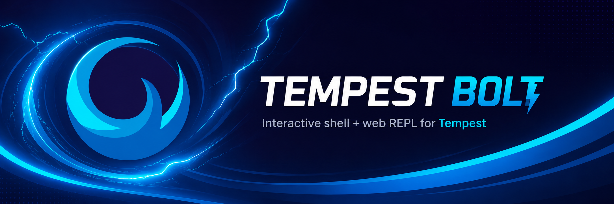

# Bolt

Bolt is a PsySH-powered interactive shell **and** a React web panel for Tempest applications.

## Installation

```bash
composer require luminarix/tempest-bolt
```

## Console shell

```bash
./tempest bolt
```

Bolt starts PsySH with these variables in scope:

- `$app` and `$container`: the Tempest container
- `$kernel`: the current Tempest kernel
- `$rootPath`: the project root
- `$internalStorage`: Tempest's internal storage path
- `$tempestVersion`: the Tempest version

## Web panel

Visit `/bolt` in your application. The panel is a self-contained React + CodeMirror REPL — it
ships its own pre-compiled assets, so no build step is required in the consuming app. Write PHP and
press <kbd>⌘/Ctrl</kbd> + <kbd>Enter</kbd> (or click **Run**) to evaluate it in the application
context.

Application classes can be referenced by their short name — `$container->get(HomeController::class)`
resolves to `\App\HomeController`. Both the web panel and the console shell alias the classes in your
application's namespaces on demand.

### Security

The web panel evaluates arbitrary PHP, so it is **disabled outside local development by default**:
it is only reachable in the `local` environment and returns `404` everywhere else.

Publish a configuration file to change this:

```bash
./tempest install bolt
```

This writes `bolt.config.php` into your application:

```php
use Tempest\Bolt\BoltConfig;
use Tempest\Core\Environment;

return new BoltConfig(
    enabled: true,
    environments: [Environment::LOCAL],
    // Optional gate, evaluated on every request. Return false to deny (403).
    authorize: fn (\Tempest\Http\Request $request): bool => $request->getSessionValue('user') !== null,
    persistScope: false,
);
```

- `enabled` — master switch.
- `environments` — environments in which the panel is reachable. Anything else returns `404`.
- `authorize` — an optional callback to gate access (e.g. to expose it to authenticated admins on
  staging). Return `false` to deny with `403`.
- `persistScope` — whether variables defined in the panel persist across executions within a session.
